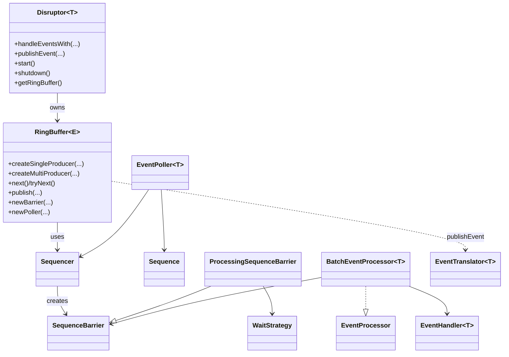

# Disruptor 项目文档
## 1. 技术亮点介绍
- **高性能线程间消息传递**：Disruptor 提供并发环形缓冲区，面向低延迟、高吞吐的异步事件处理，目标用途类似 `BlockingQueue` 但性能更优。其关键特性包括**事件广播（multicast）**、**事件预分配**、以及**可选的无锁实现**。
```15:27:/home/li/disruptor-cpp/external/disruptor/src/docs/asciidoc/en/user-guide/10_using_the_disruptor.adoc
```
- **核心模型清晰**：以 `RingBuffer`、`Sequence`、`Sequencer`、`SequenceBarrier`、`WaitStrategy`、`EventProcessor`/`EventHandler` 为核心概念，形成可组合的消费依赖图与流水线/广播模式。
```33:58:/home/li/disruptor-cpp/external/disruptor/src/docs/asciidoc/en/user-guide/10_using_the_disruptor.adoc
```
- **事件预分配**：通过 `EventFactory` 预创建事件对象，减少 GC 与分配成本，确保发布阶段只做数据填充与发布，适合低延迟场景。
```118:129:/home/li/disruptor-cpp/external/disruptor/src/docs/asciidoc/en/user-guide/10_using_the_disruptor.adoc
```
- **可选无锁/多策略等待**：通过 `WaitStrategy` 抽象，既可选择保守的阻塞策略，也可选择忙等/让出/睡眠/分阶段回退等策略以平衡吞吐与 CPU 占用。
```131:142:/home/li/disruptor-cpp/external/disruptor/src/docs/asciidoc/en/user-guide/10_using_the_disruptor.adoc
```
```363:402:/home/li/disruptor-cpp/external/disruptor/src/docs/asciidoc/en/user-guide/10_using_the_disruptor.adoc
```
- **避免伪共享**：`Sequence` 在内部通过填充与内存屏障减少伪共享，并以 `VarHandle` 实现 CAS/有序写等操作。
```36:152:/home/li/disruptor-cpp/external/disruptor/src/main/java/com/lmax/disruptor/Sequence.java
```
- **无锁序列推进与发布**：
  - `MultiProducerSequencer` 使用 `cursor.getAndAdd` 进行无锁 claim，配合 `availableBuffer` 标记数组与 `VarHandle` 的 release/acquire 语义发布与读取可用性。
  - `SequenceGroup` 通过 `AtomicReferenceFieldUpdater` CAS 更新序列数组，实现运行期增删的无锁安全。
  - `SingleProducerSequencer` 在单生产者场景下避免 CAS，仅通过 `cursor.setVolatile` 形成必要内存屏障。
```119:248:/home/li/disruptor-cpp/external/disruptor/src/main/java/com/lmax/disruptor/MultiProducerSequencer.java
```
```212:248:/home/li/disruptor-cpp/external/disruptor/src/main/java/com/lmax/disruptor/MultiProducerSequencer.java
```
```23:88:/home/li/disruptor-cpp/external/disruptor/src/main/java/com/lmax/disruptor/SequenceGroup.java
```
```95:162:/home/li/disruptor-cpp/external/disruptor/src/main/java/com/lmax/disruptor/SingleProducerSequencer.java
```
- **多任务模式组合灵活**：支持单/多生产者（`ProducerType.SINGLE`/`MULTI`），支持单消费者、广播多消费者、流水线串行与依赖图（扇出-汇合）组合。
```322:324:/home/li/disruptor-cpp/external/disruptor/src/docs/asciidoc/en/user-guide/10_using_the_disruptor.adoc
```
```67:79:/home/li/disruptor-cpp/external/disruptor/src/main/java/com/lmax/disruptor/package-info.java
```
```82:100:/home/li/disruptor-cpp/external/disruptor/src/main/java/com/lmax/disruptor/package-info.java
```
```89:116:/home/li/disruptor-cpp/external/disruptor/src/docs/asciidoc/en/user-guide/10_using_the_disruptor.adoc
```
## 2. 类结构图（核心关系）
> 以核心模块为主的结构概览（省略支持类与工具类）。

结构依据：`Disruptor` 持有 `RingBuffer`；`RingBuffer` 内部持有 `Sequencer`；`ProcessingSequenceBarrier` 组合 `WaitStrategy` 与 `Sequence`；`BatchEventProcessor` 组合 `SequenceBarrier` 与 `EventHandler`；`EventPoller` 组合 `Sequencer`/`Sequence`。
```64:111:/home/li/disruptor-cpp/external/disruptor/src/main/java/com/lmax/disruptor/dsl/Disruptor.java
```
```33:41:/home/li/disruptor-cpp/external/disruptor/src/main/java/com/lmax/disruptor/RingBuffer.java
```
```31:47:/home/li/disruptor-cpp/external/disruptor/src/main/java/com/lmax/disruptor/ProcessingSequenceBarrier.java
```
```39:45:/home/li/disruptor-cpp/external/disruptor/src/main/java/com/lmax/disruptor/BatchEventProcessor.java
```
```13:17:/home/li/disruptor-cpp/external/disruptor/src/main/java/com/lmax/disruptor/EventPoller.java
```
## 3. API 文档（核心接口/类）
### 3.1 DSL 入口
- `com.lmax.disruptor.dsl.Disruptor<T>`：构建、编排处理链并启动处理器线程。
  - 构造：支持默认或指定 `ProducerType`/`WaitStrategy`。
  - 处理链：`handleEventsWith(...)`、`after(...)` 等。
  - 发布：`publishEvent(...)`/`publishEvents(...)`。
  - 生命周期：`start()`、`halt()`、`shutdown()`。
  - 访问：`getRingBuffer()`、`getCursor()`、`getBufferSize()`。
```70:458:/home/li/disruptor-cpp/external/disruptor/src/main/java/com/lmax/disruptor/dsl/Disruptor.java
```
### 3.2 RingBuffer 与发布 API
- `RingBuffer<E>`：事件容器与发布入口；内部复用预分配事件。
  - 构建：`createSingleProducer(...)`、`createMultiProducer(...)`、`create(...)`。
  - 发布：`next()`/`tryNext()` + `publish(...)`，或直接 `publishEvent(...)`/`publishEvents(...)`。
  - 同步：`newBarrier(...)`、`addGatingSequences(...)`、`removeGatingSequence(...)`。
  - 轮询：`newPoller(...)`。
```114:405:/home/li/disruptor-cpp/external/disruptor/src/main/java/com/lmax/disruptor/RingBuffer.java
```
```451:1113:/home/li/disruptor-cpp/external/disruptor/src/main/java/com/lmax/disruptor/RingBuffer.java
```
- `EventSink<E>`：面向发布端的统一接口，覆盖单条/批量、多参数、可选 `tryPublish` 等多种发布形态。
```7:408:/home/li/disruptor-cpp/external/disruptor/src/main/java/com/lmax/disruptor/EventSink.java
```
- `EventTranslator<T>`（及 OneArg/TwoArg/ThreeArg/Vararg 变体）：负责把外部数据写入预分配事件对象。
```18:35:/home/li/disruptor-cpp/external/disruptor/src/main/java/com/lmax/disruptor/EventTranslator.java
```
### 3.3 Sequencing 与 Barrier
- `Sequencer`：序列分配与发布协调，支持 `next/tryNext`、`publish`、容量检查与可用序列扫描。
```18:101:/home/li/disruptor-cpp/external/disruptor/src/main/java/com/lmax/disruptor/Sequencer.java
```
- `SingleProducerSequencer` / `MultiProducerSequencer`：单/多生产者实现，分别优化单线程与并发生产的序列推进逻辑。
```57:246:/home/li/disruptor-cpp/external/disruptor/src/main/java/com/lmax/disruptor/SingleProducerSequencer.java
```
```26:263:/home/li/disruptor-cpp/external/disruptor/src/main/java/com/lmax/disruptor/MultiProducerSequencer.java
```
- `Sequence`：核心序列计数器，支持 `get`、`set`、`compareAndSet`、`addAndGet` 等原子操作，并通过填充减少伪共享。
```36:152:/home/li/disruptor-cpp/external/disruptor/src/main/java/com/lmax/disruptor/Sequence.java
```
- `SequenceBarrier`：消费侧等待屏障；`ProcessingSequenceBarrier` 结合 `WaitStrategy` 与依赖序列完成等待与告警。
```20:65:/home/li/disruptor-cpp/external/disruptor/src/main/java/com/lmax/disruptor/SequenceBarrier.java
```
```31:98:/home/li/disruptor-cpp/external/disruptor/src/main/java/com/lmax/disruptor/ProcessingSequenceBarrier.java
```
### 3.4 事件处理
- `EventProcessor`：消费线程的统一接口，暴露 `getSequence()`、`halt()`、`isRunning()`。
```18:45:/home/li/disruptor-cpp/external/disruptor/src/main/java/com/lmax/disruptor/EventProcessor.java
```
- `BatchEventProcessor<T>`：默认高效消费实现，批处理与生命周期回调，支持异常处理与（可选）批次回滚策略。
```24:279:/home/li/disruptor-cpp/external/disruptor/src/main/java/com/lmax/disruptor/BatchEventProcessor.java
```
- `EventHandler<T>`：用户事件处理回调，包含 `onEvent(...)` 与可选 `setSequenceCallback(...)`。
```19:54:/home/li/disruptor-cpp/external/disruptor/src/main/java/com/lmax/disruptor/EventHandler.java
```
- `ExceptionHandler<T>`：处理事件处理流程中未捕获异常的回调接口。
```19:49:/home/li/disruptor-cpp/external/disruptor/src/main/java/com/lmax/disruptor/ExceptionHandler.java
```
### 3.5 轮询式消费
- `EventPoller<T>`：提供拉取式消费模型，适用于不受 DSL 控制生命周期的线程。
```4:175:/home/li/disruptor-cpp/external/disruptor/src/main/java/com/lmax/disruptor/EventPoller.java
```
### 3.6 WaitStrategy 家族
- `WaitStrategy`：定义 `waitFor(...)` 与 `signalAllWhenBlocking()`。
```19:47:/home/li/disruptor-cpp/external/disruptor/src/main/java/com/lmax/disruptor/WaitStrategy.java
```
- 实现示例：
  - `BlockingWaitStrategy`：锁+条件变量阻塞等待。
  - `BusySpinWaitStrategy`：忙等自旋。
  - `SleepingWaitStrategy`：自旋/让出/短暂休眠。
  - `YieldingWaitStrategy`：自旋后 `Thread.yield()`。
  - `PhasedBackoffWaitStrategy`：先自旋、再让出、最后回退策略。
  - `TimeoutBlockingWaitStrategy`：阻塞等待并支持超时唤醒。
```19:60:/home/li/disruptor-cpp/external/disruptor/src/main/java/com/lmax/disruptor/BlockingWaitStrategy.java
```
```18:45:/home/li/disruptor-cpp/external/disruptor/src/main/java/com/lmax/disruptor/BusySpinWaitStrategy.java
```
```20:107:/home/li/disruptor-cpp/external/disruptor/src/main/java/com/lmax/disruptor/SleepingWaitStrategy.java
```
```19:67:/home/li/disruptor-cpp/external/disruptor/src/main/java/com/lmax/disruptor/YieldingWaitStrategy.java
```
```21:149:/home/li/disruptor-cpp/external/disruptor/src/main/java/com/lmax/disruptor/PhasedBackoffWaitStrategy.java
```
```7:80:/home/li/disruptor-cpp/external/disruptor/src/main/java/com/lmax/disruptor/TimeoutBlockingWaitStrategy.java
```
## 4. 测试用例文档
### 4.1 核心功能测试
- `RingBufferTest`
  - 验证发布/消费、序列推进、环形覆盖、容量耗尽与 `tryNext()` 行为。
  - 覆盖不同 `EventTranslator`（0/1/2/3/VarArg）发布路径与批量参数边界校验。
```52:145:/home/li/disruptor-cpp/external/disruptor/src/test/java/com/lmax/disruptor/RingBufferTest.java
```
```188:451:/home/li/disruptor-cpp/external/disruptor/src/test/java/com/lmax/disruptor/RingBufferTest.java
```
```512:1219:/home/li/disruptor-cpp/external/disruptor/src/test/java/com/lmax/disruptor/RingBufferTest.java
```
- `SequencerTest`
  - 覆盖单/多生产者 sequencer 的容量检测、发布通知、可用序列、`tryNext()`、批量 `next(n)` 与屏障等待等逻辑。
```56:329:/home/li/disruptor-cpp/external/disruptor/src/test/java/com/lmax/disruptor/SequencerTest.java
```
- `BatchEventProcessorTest`
  - 覆盖异常处理回调、生命周期回调顺序、批量大小报告、`halt()` 行为等。
```42:229:/home/li/disruptor-cpp/external/disruptor/src/test/java/com/lmax/disruptor/BatchEventProcessorTest.java
```
```153:306:/home/li/disruptor-cpp/external/disruptor/src/test/java/com/lmax/disruptor/BatchEventProcessorTest.java
```
### 4.2 重要补充测试
- `dsl/DisruptorTest`：覆盖 `start()` 语义、依赖编排、异常处理策略、超时 `shutdown`、剩余容量等 DSL 级行为。
```93:637:/home/li/disruptor-cpp/external/disruptor/src/test/java/com/lmax/disruptor/dsl/DisruptorTest.java
```
- `EventPollerTest`：验证拉取式 `EventPoller` 的 `IDLE/GATING/PROCESSING` 状态转换与缓冲区满时轮询行为。
```13:69:/home/li/disruptor-cpp/external/disruptor/src/test/java/com/lmax/disruptor/EventPollerTest.java
```
- `SequenceBarrierTest`：验证屏障等待、依赖序列推进与 `alert/clearAlert` 行为。
```41:161:/home/li/disruptor-cpp/external/disruptor/src/test/java/com/lmax/disruptor/SequenceBarrierTest.java
```
- `RewindBatchEventProcessorTest`：覆盖可回放处理器在批内回滚、多次回滚、回滚策略、放弃策略等场景。
```36:418:/home/li/disruptor-cpp/external/disruptor/src/test/java/com/lmax/disruptor/RewindBatchEventProcessorTest.java
```
- `MaxBatchSizeEventProcessorTest`：验证最大批大小限制及 `onBatchStart` 的批大小/队列深度通知。
```58:127:/home/li/disruptor-cpp/external/disruptor/src/test/java/com/lmax/disruptor/MaxBatchSizeEventProcessorTest.java
```
- `LifecycleAwareTest`：验证 `EventHandler` 生命周期 `onStart/onShutdown` 回调。
```39:75:/home/li/disruptor-cpp/external/disruptor/src/test/java/com/lmax/disruptor/LifecycleAwareTest.java
```
- `MultiProducerSequencerTest` / `SingleProducerSequencerTest`：验证多生产者可用性标记与单生产者 `hasAvailableCapacity` 不更新 cursor 的行为。
```27:39:/home/li/disruptor-cpp/external/disruptor/src/test/java/com/lmax/disruptor/MultiProducerSequencerTest.java
```
```10:24:/home/li/disruptor-cpp/external/disruptor/src/test/java/com/lmax/disruptor/SingleProducerSequencerTest.java
```
- `WaitStrategy` 相关测试：验证自旋、超时与分阶段回退等待策略的等待行为。
```25:29:/home/li/disruptor-cpp/external/disruptor/src/test/java/com/lmax/disruptor/BusySpinWaitStrategyTest.java
```
```14:32:/home/li/disruptor-cpp/external/disruptor/src/test/java/com/lmax/disruptor/TimeoutBlockingWaitStrategyTest.java
```
```26:51:/home/li/disruptor-cpp/external/disruptor/src/test/java/com/lmax/disruptor/PhasedBackoffWaitStrategyTest.java
```
```23:29:/home/li/disruptor-cpp/external/disruptor/src/test/java/com/lmax/disruptor/SleepingWaitStrategyTest.java
```
```22:28:/home/li/disruptor-cpp/external/disruptor/src/test/java/com/lmax/disruptor/YieldingWaitStrategyTest.java
```
```11:31:/home/li/disruptor-cpp/external/disruptor/src/test/java/com/lmax/disruptor/LiteTimeoutBlockingWaitStrategyTest.java
```
- `EventPublisherTest`：验证 `publishEvent`/`tryPublishEvent` 的发布语义与容量耗尽行为。
```25:64:/home/li/disruptor-cpp/external/disruptor/src/test/java/com/lmax/disruptor/EventPublisherTest.java
```
- `EventTranslatorTest`：验证 `EventTranslator` 能将外部数据写入事件对象。
```23:53:/home/li/disruptor-cpp/external/disruptor/src/test/java/com/lmax/disruptor/EventTranslatorTest.java
```
- `SequenceTest`：验证 `Sequence` 的 `addAndGet`/`incrementAndGet`/`getAndAdd` 等原子操作语义。
```7:34:/home/li/disruptor-cpp/external/disruptor/src/test/java/com/lmax/disruptor/SequenceTest.java
```
- `SequenceGroupTest` / `FixedSequenceGroupTest`：验证序列组的最小值计算、增删与运行中加入、固定分组取最小等行为。
```26:147:/home/li/disruptor-cpp/external/disruptor/src/test/java/com/lmax/disruptor/SequenceGroupTest.java
```
```24:38:/home/li/disruptor-cpp/external/disruptor/src/test/java/com/lmax/disruptor/FixedSequenceGroupTest.java
```
- `SequenceReportingCallbackTest`：验证 `EventHandler#setSequenceCallback` 回调上报进度，确保批处理器序列推进。
```26:81:/home/li/disruptor-cpp/external/disruptor/src/test/java/com/lmax/disruptor/SequenceReportingCallbackTest.java
```
- `AggregateEventHandlerTest`：验证聚合处理器对 `onEvent/onStart/onShutdown` 的顺序调用与空处理器集容错。
```25:99:/home/li/disruptor-cpp/external/disruptor/src/test/java/com/lmax/disruptor/AggregateEventHandlerTest.java
```
- `RingBufferWithAssertingStubTest`：验证 `RingBuffer` 对 `Sequencer` 的委托调用（`next/tryNext`、批量发布等）。
```12:175:/home/li/disruptor-cpp/external/disruptor/src/test/java/com/lmax/disruptor/RingBufferWithAssertingStubTest.java
```
- `BatchingTest`：验证多处理器并行消费下的批处理刷新与批量计数一致性（多/单生产者）。
```18:100:/home/li/disruptor-cpp/external/disruptor/src/test/java/com/lmax/disruptor/BatchingTest.java
```
- `DisruptorStressTest`：多线程压力场景下的发布/消费一致性与失败计数验证。
```19:179:/home/li/disruptor-cpp/external/disruptor/src/test/java/com/lmax/disruptor/DisruptorStressTest.java
```
- `FatalExceptionHandlerTest` / `IgnoreExceptionHandlerTest` / `ShutdownOnFatalExceptionTest`：验证异常处理器抛出/忽略行为及致命异常下的安全关闭。
```24:37:/home/li/disruptor-cpp/external/disruptor/src/test/java/com/lmax/disruptor/FatalExceptionHandlerTest.java
```
```21:31:/home/li/disruptor-cpp/external/disruptor/src/test/java/com/lmax/disruptor/IgnoreExceptionHandlerTest.java
```
```14:103:/home/li/disruptor-cpp/external/disruptor/src/test/java/com/lmax/disruptor/ShutdownOnFatalExceptionTest.java
```
- `dsl/ConsumerRepositoryTest`：验证 DSL 侧消费者仓库的处理器/屏障注册与查询异常处理。
```33:88:/home/li/disruptor-cpp/external/disruptor/src/test/java/com/lmax/disruptor/dsl/ConsumerRepositoryTest.java
```
> `src/test/java/com/lmax/disruptor/` 目录下还包含 `UtilTest`、`RingBufferEventMatcher` 等辅助测试/断言类，可按需继续扩展。
